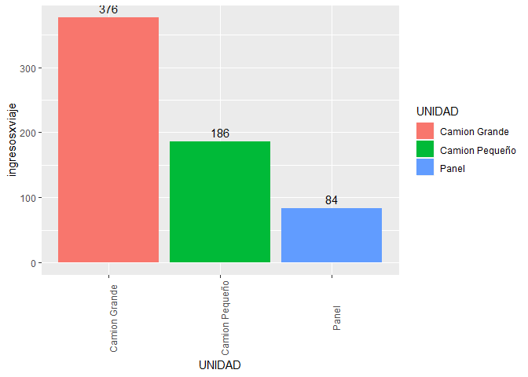

Laboratorio 3
================

    ## Warning: Missing column names filled in: 'X1' [1]

    ## Parsed with column specification:
    ## cols(
    ##   X1 = col_double(),
    ##   COD_VIAJE = col_double(),
    ##   CLIENTE = col_character(),
    ##   UBICACION = col_double(),
    ##   CANTIDAD = col_double(),
    ##   PILOTO = col_character(),
    ##   Q = col_double(),
    ##   CREDITO = col_double(),
    ##   UNIDAD = col_character(),
    ##   MES = col_character(),
    ##   ANIO = col_double()
    ## )

\#\#¿Debemos invertir en la contratación de mas personal?

``` r
numero_pilotos <- n_distinct(data_distribuidor$PILOTO)
data_personal <- data_distribuidor %>% 
  select(MES) %>% 
  group_by(MES) %>% 
  summarise(viajes_promedio = n()/numero_pilotos)
data_personal
```

    ## # A tibble: 11 x 2
    ##    MES   viajes_promedio
    ##    <chr>           <dbl>
    ##  1 01               21.3
    ##  2 02               22.6
    ##  3 03               20.2
    ##  4 04               21.8
    ##  5 05               23.9
    ##  6 06               21.9
    ##  7 07               23.4
    ##  8 08               22.1
    ##  9 09               20.9
    ## 10 10               22.2
    ## 11 11               21.9

\#\#¿Debemos invertir en la compra de mas vehiculos de
distribución?¿Cuantos y de que tipo?

``` r
filter(data_distribuidor, UNIDAD == 'Camion Grande' & CANTIDAD < 1000)
```

    ## # A tibble: 0 x 11
    ## # ... with 11 variables: X1 <dbl>, COD_VIAJE <dbl>, CLIENTE <chr>,
    ## #   UBICACION <dbl>, CANTIDAD <dbl>, PILOTO <chr>, Q <dbl>, CREDITO <fct>,
    ## #   UNIDAD <fct>, MES <chr>, ANIO <dbl>

``` r
filter(data_distribuidor, UNIDAD == 'Camion Pequeño' & (CANTIDAD > 1000 | CANTIDAD < 500))
```

    ## # A tibble: 0 x 11
    ## # ... with 11 variables: X1 <dbl>, COD_VIAJE <dbl>, CLIENTE <chr>,
    ## #   UBICACION <dbl>, CANTIDAD <dbl>, PILOTO <chr>, Q <dbl>, CREDITO <fct>,
    ## #   UNIDAD <fct>, MES <chr>, ANIO <dbl>

``` r
filter(data_distribuidor, UNIDAD == 'Panel' & CANTIDAD > 500)
```

    ## # A tibble: 0 x 11
    ## # ... with 11 variables: X1 <dbl>, COD_VIAJE <dbl>, CLIENTE <chr>,
    ## #   UBICACION <dbl>, CANTIDAD <dbl>, PILOTO <chr>, Q <dbl>, CREDITO <fct>,
    ## #   UNIDAD <fct>, MES <chr>, ANIO <dbl>

``` r
data_unidades <- left_join(data_distribuidor %>%
  select(UNIDAD,MES) %>% 
  group_by(UNIDAD,MES) %>% 
  summarise(viajes_unidades = n()), data_distribuidor%>%
  select(MES) %>% 
  group_by(MES) %>% 
  summarise(viajes_totales = n()), by = c("MES"="MES"))
data_unidades$porcentaje_viajes <- data_unidades$viajes_unidades/data_unidades$viajes_totales * 100
data_unidades %>% 
  group_by(UNIDAD) %>% 
  summarise(porcentaje_promedio_uso = mean(porcentaje_viajes))
```

    ## # A tibble: 3 x 2
    ##   UNIDAD         porcentaje_promedio_uso
    ##   <fct>                            <dbl>
    ## 1 Camion Grande                     55.6
    ## 2 Camion Pequeño                    27.7
    ## 3 Panel                             16.7

\#\#¿Las tarifas actuales son aceptables por el cliente?

``` r
data_limpia <- data_distribuidor
data_limpia$CLIENTE <- gsub("/ Despacho a cliente","",data_limpia$CLIENTE, fixed = TRUE)
data_limpia$CLIENTE <- gsub("|||Faltante","",data_limpia$CLIENTE, fixed = TRUE)
data_limpia$CLIENTE <- gsub("|||DEVOLUCION","",data_limpia$CLIENTE, fixed = TRUE)
data_limpia$CLIENTE <- gsub("|||FALTANTE","",data_limpia$CLIENTE, fixed = TRUE)
data_limpia$CLIENTE <- gsub("/Despacho a cliente","",data_limpia$CLIENTE, fixed = TRUE)
data_limpia$CLIENTE <- gsub("/Despachoacliente","",data_limpia$CLIENTE, fixed = TRUE)
data_limpia$CLIENTE <- gsub(" |||","",data_limpia$CLIENTE)
data_limpia$CLIENTE <- sub("|||","",data_limpia$CLIENTE, fixed = TRUE)
data_limpia1 <- data_limpia
data_limpia <- left_join(data_limpia %>% 
  select(MES,Q) %>% 
  group_by(MES) %>% 
  summarise(ingresos = sum(Q)),data_limpia %>% 
  select(MES,CLIENTE) %>% 
  group_by(MES) %>% 
  summarise(clientes_unicos = n_distinct(CLIENTE)), by = c("MES"="MES"))
data_limpia
```

    ## # A tibble: 11 x 3
    ##    MES   ingresos clientes_unicos
    ##    <chr>    <dbl>           <int>
    ##  1 01      55416.              13
    ##  2 02      56226.              13
    ##  3 03      48467.              13
    ##  4 04      51708.              13
    ##  5 05      60075               13
    ##  6 06      52262               13
    ##  7 07      56683.              13
    ##  8 08      53262.              13
    ##  9 09      51519.              13
    ## 10 10      55180.              13
    ## 11 11      58050               13

\#\#¿Nos estan
robando?

``` r
filas_faltante <- grep("FALTANTE", data_distribuidor$CLIENTE, ignore.case = TRUE)
data_pilotos <- left_join(data_distribuidor[filas_faltante,] %>%
  select(PILOTO,MES) %>% 
  group_by(PILOTO,MES) %>% 
  summarise(viajes_faltantes = n()), data_distribuidor%>%
  select(PILOTO,MES) %>% 
  group_by(PILOTO,MES) %>% 
  summarise(viajes_totales = n()), by = c("PILOTO"="PILOTO", "MES"="MES"))
data_pilotos$porcentajes_faltantes <- data_pilotos$viajes_faltantes/data_pilotos$viajes_totales
data_pilotos %>% 
  group_by(PILOTO) %>% 
  summarise(promedio_faltantes_porcentaje = mean(porcentajes_faltantes)*100) %>% 
  arrange(desc(promedio_faltantes_porcentaje))
```

    ## # A tibble: 9 x 2
    ##   PILOTO                        promedio_faltantes_porcentaje
    ##   <chr>                                                 <dbl>
    ## 1 Ismael Rodero Monteagudo                               36.3
    ## 2 Hector Aragones Frutos                                 35.3
    ## 3 Juan Francisco Portillo Gomez                          35.1
    ## 4 Pedro Alvarez Parejo                                   34.3
    ## 5 Fernando Mariano Berrio                                33.5
    ## 6 Angel Valdez Alegria                                   33.5
    ## 7 Hector Giron                                           31.3
    ## 8 Felipe Villatoro                                       29.2
    ## 9 Luis Jaime Urbano                                      25.6

\#\#80-20 de clientes y cuáles de ellos son los más importantes

``` r
data_grafica <- left_join(data_limpia1 %>%
  select(MES,CLIENTE,Q) %>% 
  group_by(MES,CLIENTE) %>% 
  summarise(ingresos = sum(Q)) %>%
  arrange(MES,desc(ingresos)),
  data_limpia1 %>% 
    select(MES,Q) %>% 
    group_by(MES) %>% 
    summarise(ingresos = sum(Q)), by = c("MES" = "MES")) %>% 
  mutate(porcentaje_mensual = ingresos.x/ingresos.y)
data_grafica$suma_acum <- ave(data_grafica$porcentaje_mensual,data_grafica$MES,FUN=cumsum)
data_grafica$factor_agrup <- if_else(data_grafica$suma_acum < 0.8,1,0)
data_grafica$factor_agrup <- if_else(data_grafica$factor_agrup == 1, data_grafica$CLIENTE, "OTRO")
count(data_grafica,factor_agrup,sort=TRUE) %>% 
  group_by(factor_agrup) %>% 
  summarise(veces = sum(n)) %>% 
  filter(factor_agrup != "OTRO") %>% 
  arrange(desc(veces))
```

    ## # A tibble: 13 x 2
    ##    factor_agrup                   veces
    ##    <chr>                          <int>
    ##  1 ELGALLONEGRO                      11
    ##  2 ELPINCHEOBELISCO                  11
    ##  3 POLLOPINULITO                     11
    ##  4 TAQUERIAELCHINITO                 11
    ##  5 UBIQUOLABS                        10
    ##  6 BARLAOFICINA                       8
    ##  7 TIENDALABENDICION                  6
    ##  8 ABARROTERIAEBENEZER                5
    ##  9 CHICHARRONERIAELRICOCOLESTEROL     4
    ## 10 SPORTA,S.A.                        4
    ## 11 UNIVERSIDADFRANCISCOMARROQUIN      4
    ## 12 HOSPITALLASAMERICAS                1
    ## 13 HOSPITALROOSEVELT                  1

``` r
for(j in unique(data_grafica$MES)){
  graph8020 <- ggplot(data_grafica[data_grafica$MES == j,], 
                  aes(x=MES,y=ingresos.x,fill=factor_agrup))+
    geom_bar(width = 1, stat = "identity") + coord_polar("y", start=0)
    print(graph8020)}
```

<!-- --><!-- --><!-- --><!-- --><!-- --><!-- --><!-- --><!-- --><!-- --><!-- --><!-- -->
\#Mejores pilotos y transportes más efectivos

``` r
left_join(data_distribuidor %>% 
                               select(PILOTO,Q) %>% 
                               group_by(PILOTO) %>% 
                               summarise(ingresos = sum(Q)),
          data_distribuidor %>%
                               select(PILOTO) %>% 
                               group_by(PILOTO) %>% 
                               summarise(viajes_totales = n()), by = c("PILOTO" = "PILOTO")) %>% 
  mutate(ingresosxviaje = ingresos/viajes_totales) %>% 
  arrange(desc(ingresosxviaje)) %>% 
  ggplot(aes(x=PILOTO,y=ingresosxviaje, fill = PILOTO))+geom_col()+theme(axis.text.x = element_text(angle = 90))+geom_text(aes(label = round(ingresosxviaje)), vjust = -0.5)
```

<!-- -->

``` r
left_join(data_distribuidor %>% 
                               select(UNIDAD,Q) %>% 
                               group_by(UNIDAD) %>% 
                               summarise(ingresos = sum(Q)),
          data_distribuidor %>%
                               select(UNIDAD) %>% 
                               group_by(UNIDAD) %>% 
                               summarise(viajes_totales = n()), by = c("UNIDAD" = "UNIDAD")) %>% 
  mutate(ingresosxviaje = ingresos/viajes_totales) %>% 
  arrange(desc(ingresosxviaje)) %>% 
  ggplot(aes(x=UNIDAD,y=ingresosxviaje, fill = UNIDAD))+geom_col()+theme(axis.text.x = element_text(angle = 90))+geom_text(aes(label = round(ingresosxviaje)), vjust = -0.5)
```

<!-- -->
