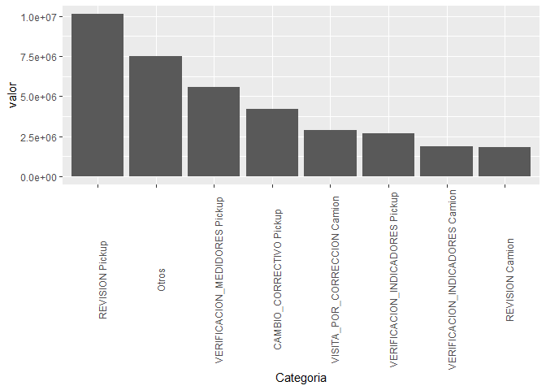
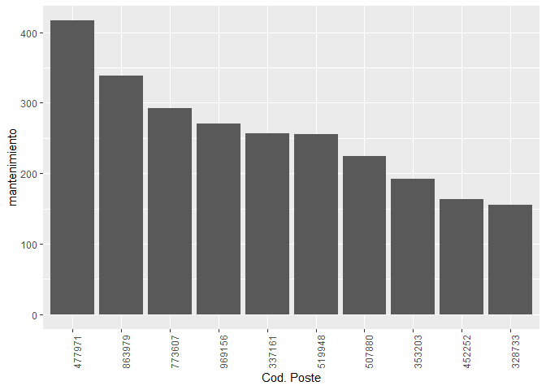
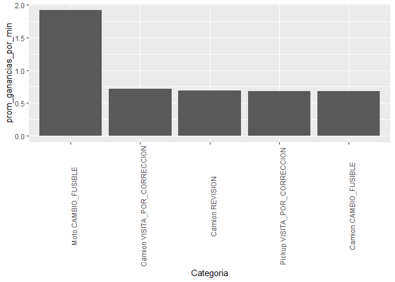

Laboratorio \#7
================

\#Bibliotecas

``` r
require(dplyr)
```

    ## Loading required package: dplyr

    ## 
    ## Attaching package: 'dplyr'

    ## The following objects are masked from 'package:stats':
    ## 
    ##     filter, lag

    ## The following objects are masked from 'package:base':
    ## 
    ##     intersect, setdiff, setequal, union

``` r
require(tidyverse)
```

    ## Loading required package: tidyverse

    ## -- Attaching packages -------------------------------------------------------------------------------- tidyverse 1.2.1 --

    ## v ggplot2 3.2.1     v readr   1.3.1
    ## v tibble  2.1.3     v purrr   0.3.2
    ## v tidyr   0.8.3     v stringr 1.4.0
    ## v ggplot2 3.2.1     v forcats 0.4.0

    ## -- Conflicts ----------------------------------------------------------------------------------- tidyverse_conflicts() --
    ## x dplyr::filter() masks stats::filter()
    ## x dplyr::lag()    masks stats::lag()

``` r
require(stringr)
require(reshape2)
```

    ## Loading required package: reshape2

    ## 
    ## Attaching package: 'reshape2'

    ## The following object is masked from 'package:tidyr':
    ## 
    ##     smiths

``` r
require(lubridate)
```

    ## Loading required package: lubridate

    ## 
    ## Attaching package: 'lubridate'

    ## The following object is masked from 'package:base':
    ## 
    ##     date

``` r
require(ggplot2)
```

\#Cargar
datos

``` r
data <- read_csv('c1.csv') %>%  select(Fecha, ID, camion = Camion_5,pickup = Pickup,moto = Moto, cod = Cod, origen, Lat, Long, factura,
                                  variable_camion = directoCamion_5, variable_pickup = directoPickup, variable_moto = directoMoto,
                                  fijo_camion = fijoCamion_5, fijo_pickup = fijoPickup, fijo_moto = fijoMoto, height, `5-30`,`30-45`,
                                  `45-75`,`75-120`,`120+`)
```

    ## Warning: Missing column names filled in: 'X23' [23], 'X24' [24],
    ## 'X25' [25], 'X26' [26], 'X27' [27], 'X28' [28]

    ## Parsed with column specification:
    ## cols(
    ##   .default = col_character(),
    ##   ID = col_double(),
    ##   origen = col_double(),
    ##   Lat = col_double(),
    ##   Long = col_double(),
    ##   height = col_double(),
    ##   X23 = col_logical(),
    ##   X24 = col_logical(),
    ##   X25 = col_logical(),
    ##   X26 = col_logical(),
    ##   X27 = col_logical(),
    ##   X28 = col_logical()
    ## )

    ## See spec(...) for full column specifications.

``` r
data$camion <- substring(data$camion,2)
data$pickup <- substring(data$pickup,2)
data$moto <- substring(data$moto,2)
data$factura <- substring(data$factura,2)
data$variable_camion <- substring(data$variable_camion,2)
data$variable_moto <- substring(data$variable_moto,2)
data$variable_pickup <- substring(data$variable_pickup,2)
data$fijo_camion <- substring(data$fijo_camion,2)
data$fijo_moto <- substring(data$fijo_moto,2)
data$fijo_pickup <- substring(data$fijo_pickup,2)
for(x in c("camion","moto","pickup","factura","variable_camion","variable_moto","variable_pickup","fijo_camion","fijo_moto","fijo_pickup")){
  data[data[[x]] == "-",x] <- 0
  data[x] <- as.numeric(data[[x]])
}
tidy_function_1 <- function(x){
  if(x[3] > 0){
      return(as.character("Camion"))
  } else if(x[4] > 0){
      return(as.character("Pickup"))
  } else if(x[5] > 0){
      return(as.character("Moto"))
    }
  }
tidy_function_2 <- function(x){
  if(x[3] > 0){
      return(as.numeric(x[3]))
  } else if(x[4] > 0){
      return(as.numeric(x[4]))
  } else if(x[5] > 0){
      return(as.numeric(x[5]))
    }
  }
data$vehiculo <- apply(data,1,tidy_function_1)
data$vehiculo <- apply(data,1,tidy_function_1)
data$costo_total <- apply(data,1,tidy_function_2)
data$costo_total <- apply(data,1,tidy_function_2)
tidy_function_3 <- function(x){
  if(x[3] > 0){
      return(as.numeric(x[11]))
  } else if(x[4] > 0){
      return(as.numeric(x[12]))
  } else if(x[5] > 0){
      return(as.numeric(x[13]))
  }
}
tidy_function_4 <- function(x){
  if(x[3] > 0){
      return(as.numeric(x[14]))
  } else if(x[4] > 0){
      return(as.numeric(x[15]))
  } else if(x[5] > 0){
      return(as.numeric(x[16]))
    }
  }
data$costo_variable <- apply(data,1,tidy_function_3)
data$costo_variable <- apply(data,1,tidy_function_3)
data$costo_fijo <- apply(data,1,tidy_function_4)
data$costo_fijo <- apply(data,1,tidy_function_4)
tidy_function_5 <- function(x){
  if(!is.na(x[18] == "x")){
    return("5-30")
  } else if(!is.na(x[19] == "x")){
    return("30-45")
  } else if(!is.na(x[20] == "x")){
    return("45-75")
  } else if(!is.na(x[21] == "x")){
    return("75-120")
  } else if(!is.na(x[22] == "x")){
    return("120+")
  }
}
data$minutos <- apply(data,1,tidy_function_5)
data$Fecha <- dmy(data$Fecha)
data <- data %>% 
  select(Fecha, ID,cod,vehiculo,minutos,factura,costo_total,costo_fijo,costo_variable, origen)
data$ganancia <- data$factura - data$costo_total
```

\#Obtener Estados de Resultados

``` r
#estado_de_resultados
ingresos_totales <- c()
costos_totales <- c()
for(x in c(unique(data$cod),"total")){
  if(x != "total"){
    ingresos <- sum(data[data$cod == x,"factura"])
    ingresos_totales <- c(ingresos_totales, ingresos)
    print(paste("Ingresos por",x,": Q.",format(ingresos, big.mark = ",", scientific = FALSE, trim = TRUE)))
  } else if(x == "total"){
    print("--------------------------------------------------------------------------------------------------------")
    print(paste("Ingresos totales por servicios: Q.", format(sum(ingresos_totales),big.mark = ",", scientific = FALSE, trim = TRUE)))
  }
}
```

    ## [1] "Ingresos por VERIFICACION_MEDIDORES : Q. 6,236,958"
    ## [1] "Ingresos por REVISION_TRANSFORMADOR : Q. 1,970,486"
    ## [1] "Ingresos por REVISION : Q. 11,968,468"
    ## [1] "Ingresos por CAMBIO_FUSIBLE : Q. 2,936,608"
    ## [1] "Ingresos por OTRO : Q. 1,037,758"
    ## [1] "Ingresos por CAMBIO_CORRECTIVO : Q. 4,465,830"
    ## [1] "Ingresos por VERIFICACION_INDICADORES : Q. 4,530,103"
    ## [1] "Ingresos por VISITA : Q. 304,350.7"
    ## [1] "Ingresos por VISITA_POR_CORRECCION : Q. 2,912,254"
    ## [1] "Ingresos por CAMBIO_PUENTES : Q. 325,281.4"
    ## [1] "--------------------------------------------------------------------------------------------------------"
    ## [1] "Ingresos totales por servicios: Q. 36,688,096"

``` r
for(x in c(unique(data$cod),"total")){
  if(x != "total"){
    costo_de_ventas <- sum(data[data$cod == x,"costo_variable"])
    costos_totales <- c(costos_totales,costo_de_ventas)
    print(paste("Costo de ventas por",x,": ( Q.",format(costo_de_ventas, big.mark = ",", scientific = FALSE, trim = TRUE),")"))
  } else if(x == "total"){
    print("--------------------------------------------------------------------------------------------------------")
    print(paste("Utilidad bruta : Q.", format(sum(ingresos_totales - costos_totales), big.mark = ",", scientific = FALSE, trim = TRUE)))
    print(paste("Costos fijos: -Q.", format(sum(data["costo_fijo"]), big.mark = ",", scientific = FALSE, trim = TRUE)))
    print("--------------------------------------------------------------------------------------------------------")
    print(paste("Utilidad antes de intereses, depreciaciones, amortizaciones e impuestos (EBIDTA): Q.", format(sum(ingresos_totales - costos_totales) - sum(data["costo_fijo"]), big.mark = ",", scientific = FALSE, trim = TRUE)))
  }
}
```

    ## [1] "Costo de ventas por VERIFICACION_MEDIDORES : ( Q. 3,095,330 )"
    ## [1] "Costo de ventas por REVISION_TRANSFORMADOR : ( Q. 970,001.1 )"
    ## [1] "Costo de ventas por REVISION : ( Q. 5,917,567 )"
    ## [1] "Costo de ventas por CAMBIO_FUSIBLE : ( Q. 1,322,017 )"
    ## [1] "Costo de ventas por OTRO : ( Q. 494,162.9 )"
    ## [1] "Costo de ventas por CAMBIO_CORRECTIVO : ( Q. 2,193,768 )"
    ## [1] "Costo de ventas por VERIFICACION_INDICADORES : ( Q. 2,213,474 )"
    ## [1] "Costo de ventas por VISITA : ( Q. 149,611.2 )"
    ## [1] "Costo de ventas por VISITA_POR_CORRECCION : ( Q. 1,378,330 )"
    ## [1] "Costo de ventas por CAMBIO_PUENTES : ( Q. 159,345.2 )"
    ## [1] "--------------------------------------------------------------------------------------------------------"
    ## [1] "Utilidad bruta : Q. 18,794,489"
    ## [1] "Costos fijos: -Q. 10,280,412"
    ## [1] "--------------------------------------------------------------------------------------------------------"
    ## [1] "Utilidad antes de intereses, depreciaciones, amortizaciones e impuestos (EBIDTA): Q. 8,514,077"

\#Como quedo el tarifario 2017

``` r
data$dif_precios <- (data$factura - data$costo_total)
tarifario <- data %>% 
  select(cod, vehiculo, factura) %>% 
  group_by(vehiculo,cod) %>% 
  summarise(costo_promedio = mean(factura)) %>% 
  arrange(desc(costo_promedio), .by_group = TRUE)
print(tarifario)
```

    ## # A tibble: 21 x 3
    ## # Groups:   vehiculo [3]
    ##    vehiculo cod                      costo_promedio
    ##    <chr>    <chr>                             <dbl>
    ##  1 Camion   CAMBIO_PUENTES                     197.
    ##  2 Camion   REVISION_TRANSFORMADOR             191.
    ##  3 Camion   VERIFICACION_INDICADORES           191.
    ##  4 Camion   VISITA                             188.
    ##  5 Camion   CAMBIO_CORRECTIVO                  187.
    ##  6 Camion   VERIFICACION_MEDIDORES             186.
    ##  7 Camion   REVISION                           185.
    ##  8 Camion   CAMBIO_FUSIBLE                     184.
    ##  9 Camion   OTRO                               178.
    ## 10 Camion   VISITA_POR_CORRECCION              177.
    ## # ... with 11 more rows

\#Las tarifas son aceptables por el cliente

``` r
contratos_mensuales <- data %>% 
  mutate(month = month(Fecha, label = TRUE)) %>% 
  select(month, ID) %>% 
  group_by(month) %>% 
  summarise(ventas = n()) %>% 
  arrange(month)
print(contratos_mensuales)
```

    ## # A tibble: 12 x 2
    ##    month ventas
    ##    <ord>  <int>
    ##  1 Jan    22202
    ##  2 Feb    19851
    ##  3 Mar    22547
    ##  4 Apr    21631
    ##  5 May    22410
    ##  6 Jun    21464
    ##  7 Jul    22613
    ##  8 Aug    22413
    ##  9 Sep    21829
    ## 10 Oct    22681
    ## 11 Nov    21681
    ## 12 Dec    22403

\#Estamos en números
rojos

``` r
EBITDA <- sum(ingresos_totales - costos_totales) - sum(data["costo_fijo"])
print(paste("Si la suma de las depreciaciones, intereses, amortizaciones y (dividendos/0.75) es mayor que: Q.", format(EBITDA, big.mark = ",", trim = TRUE),"entonces nos encontramos en números rojos."))
```

    ## [1] "Si la suma de las depreciaciones, intereses, amortizaciones y (dividendos/0.75) es mayor que: Q. 8,514,077 entonces nos encontramos en números rojos."

\#cuando podemos perderle a una reparación o mantenimiento

``` r
print(nrow(data[data$factura <= data$costo_total,]))
```

    ## [1] 0

\#deberiamos abrir más centros de distribución

``` r
data %>% 
  mutate(month = month(Fecha)) %>% 
  select(origen, month) %>% 
  group_by(origen, month) %>% 
  summarise(pedidos = n())
```

    ## # A tibble: 48 x 3
    ## # Groups:   origen [4]
    ##    origen month pedidos
    ##     <dbl> <dbl>   <int>
    ##  1 150224     1    8625
    ##  2 150224     2    7938
    ##  3 150224     3    9037
    ##  4 150224     4    8659
    ##  5 150224     5    8995
    ##  6 150224     6    8494
    ##  7 150224     7    8939
    ##  8 150224     8    8963
    ##  9 150224     9    8622
    ## 10 150224    10    9048
    ## # ... with 38 more rows

\#80-20 de factura

``` r
datos_grafica <- data %>% 
  select(cod, vehiculo, factura) %>% 
  group_by(cod, vehiculo) %>% 
  summarise(total = sum(factura))
ventas_totales <- sum(datos_grafica$total)
datos_grafica <- datos_grafica %>% mutate(porc = total/ventas_totales) %>% arrange(desc(porc)) %>% ungroup()
datos_grafica$suma_acum <- ave(datos_grafica$porc,FUN=cumsum)
datos_grafica$cat <- ifelse(datos_grafica$suma_acum <= 0.8,paste(datos_grafica$cod,datos_grafica$vehiculo),"Otros")
datos_grafica <- datos_grafica %>% select(cat,total) %>%  group_by(cat) %>% summarise(valor = sum(total)) %>%  arrange(desc(valor)) %>% ungroup()
ggplot(data = datos_grafica, aes(x = reorder(cat,-valor), y = valor)) + geom_bar(stat = "identity") + theme(axis.text.x = element_text(angle = 90)) + scale_x_discrete(name ="Categoria")
```

<!-- -->
\#Postes con mayor
mantenimiento

``` r
datos_grafica_2 <- data %>% select(ID) %>% group_by(ID) %>%  summarise(mantenimiento = n()) %>% arrange(desc(mantenimiento)) %>% head(10)
datos_grafica_2$ID <- as.factor(datos_grafica_2$ID)
ggplot(data = datos_grafica_2, aes(x = reorder(ID,-mantenimiento), y = mantenimiento)) + geom_bar(stat = "identity") + theme(axis.text.x = element_text(angle = 90)) + scale_x_discrete(name ="Cod. Poste")
```

<!-- -->
\#Recorridos más efectivos

``` r
datos_grafica_3 <- data %>% select(vehiculo, cod, minutos, ganancia)
datos_grafica_3$tiempo_prom <- ifelse(datos_grafica_3$minutos == "120+",120,
                                      ifelse(datos_grafica_3$minutos == "75-120",97.5,
                                             ifelse(datos_grafica_3$minutos == "45-75",60,
                                                    ifelse(datos_grafica_3$minutos == "30-45",37.5,
                                                           ifelse(datos_grafica_3$minutos == "5-30",17.5,1)))))
datos_grafica_3$ganancia_por_minuto <- datos_grafica_3$ganancia/datos_grafica_3$tiempo_prom
datos_grafica_3$cat <- paste(datos_grafica_3$vehiculo,datos_grafica_3$cod)
datos_grafica_3 <- datos_grafica_3 %>% select(cat,ganancia_por_minuto) %>% group_by(cat) %>% summarise(prom_ganancias_por_min = mean(ganancia_por_minuto)) %>%  arrange(desc(prom_ganancias_por_min)) %>% head(5)
ggplot(data = datos_grafica_3, aes(x = reorder(cat,-prom_ganancias_por_min), y = prom_ganancias_por_min)) + geom_bar(stat = "identity") + theme(axis.text.x = element_text(angle = 90)) + scale_x_discrete(name ="Categoria")
```

<!-- -->
\#Analisis \#En terminos de estrategias a seguir, se recomienda no
buscar expandir más la empresa, ya que existen dos centros de
distribución que estan siendo menos efectivos (en rubro de viajes) a
comparación de los otros dos. Se deberia tratar de incrementar el número
de camiones y pickups, ya que estos parecen primordialmente ser los
componentes que generan un mayor retorno, aunque las motos tienen un
buen rendimiento en terminos de eficiencia. Los precios que se les estan
ofreciendo a los clientes al parecer no ha tenido un impacto negativo
durante este año, ya que el número de reparaciones se ha mantenido
relativamente estable. Mientras que no se puede inferir si la empresa se
encuentra en números rojos o no, se piensa que deberia ser una prioridad
reducir los intereses y otros costos de financiamiento para mantener la
mayor cantidad posible del EBITDA, que es un monto de Q. 8,514,077.
